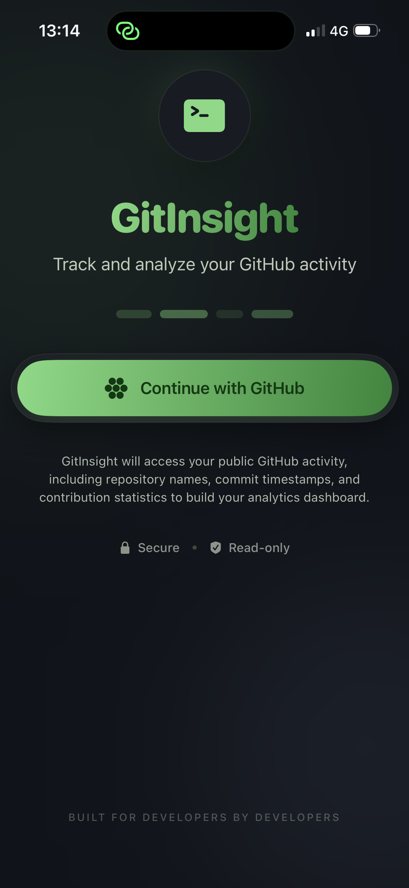
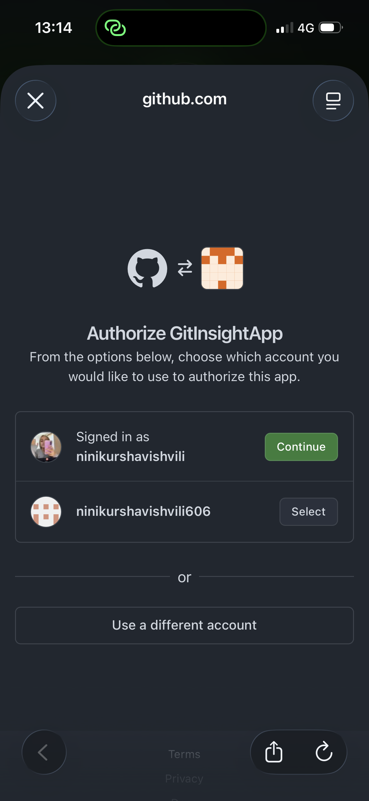
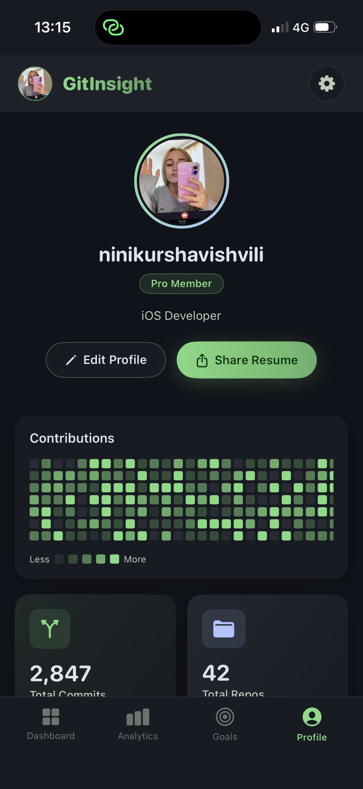
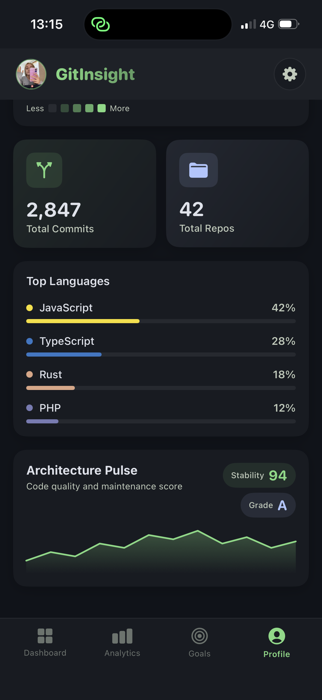

# GitInsight

## Description
GitInsight is an entry-level application designed to provide insights into Git repositories, helping users understand their projects better.

## Screenshots

  
  
  
  

*Place images for various views in the 'docs/screens' directory.*

## GitHub Authentication
This application uses GitHub OAuth for authentication. Please ensure that your client secrets are not committed to the repository. Set up the following environment variables:
- `GITHUB_CLIENT_ID=your_client_id`
- `GITHUB_CLIENT_SECRET=your_client_secret`

## Future Implementations
- Enhanced analytics dashboard
- User activity tracking
- Repository comparison tools

## Getting Started
To run the app:
1. Ensure all dependencies are installed.
2. Use the following commands:
